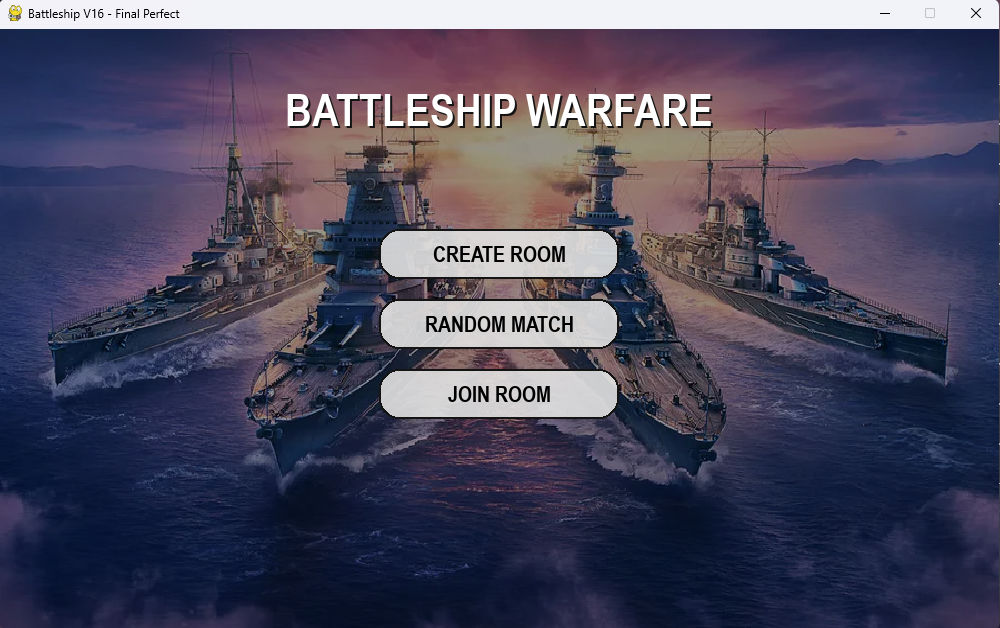
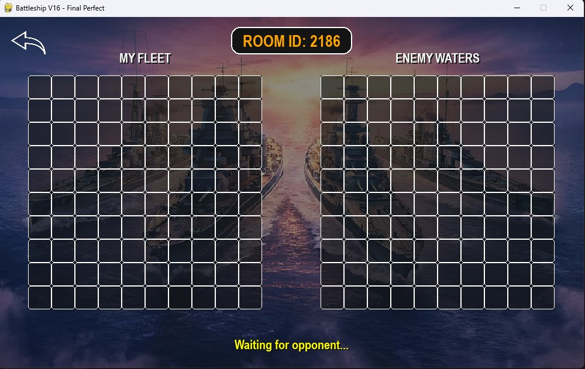
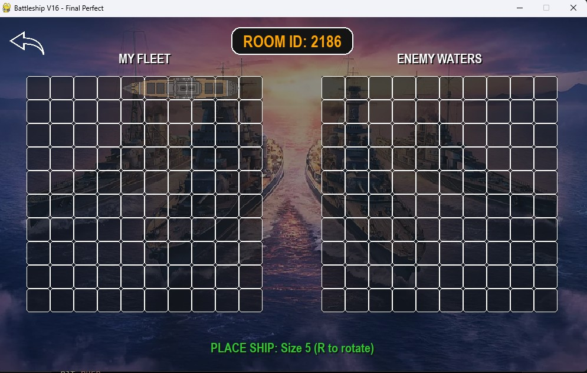
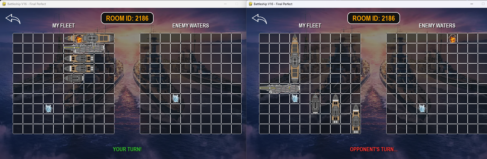
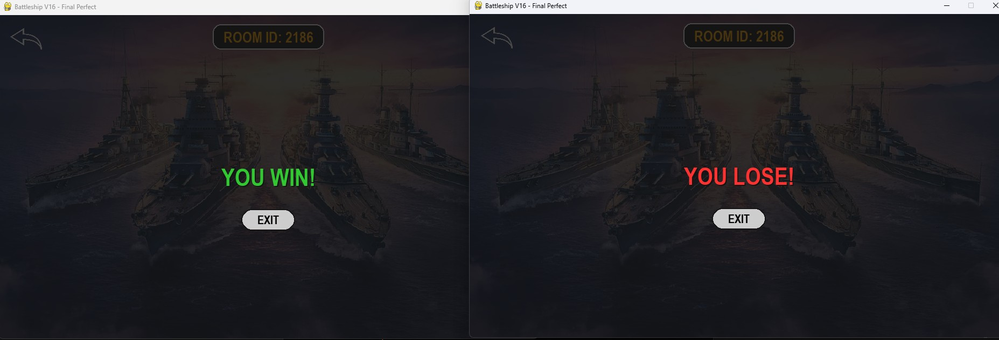

```markdown
# Battleship Multiplayer 🚢💥

Một game **Chiến hạm (Battleship)** multiplayer cổ điển, được viết bằng **Python + Pygame**.  
Hỗ trợ 2 người chơi trên cùng máy (localhost) hoặc cùng mạng LAN, với giao diện đẹp, hiệu ứng bắn nổ/chìm tàu sống động và logic chặt chẽ.

 


## Tính năng nổi bật
- Tạo phòng / Join phòng bằng ID / **Random Match** tự động thông minh
- Đặt tàu tự do: click để đặt + phím **R** để xoay tàu
- Chơi realtime, hiển thị lượt rõ ràng
- Hiệu ứng hit/miss/sunk đẹp mắt (nổ, nước bắn)
- Thoát game mượt mà với popup confirm
- Random match ưu tiên vào phòng có sẵn → dễ chơi lại với cùng đối thủ
- Sau ván thắng/thua, có thể tiếp tục chơi ván mới ngay

## Yêu cầu hệ thống
- Python 3.8 trở lên
- Pygame 2.5.2

## Cài đặt

```bash
git clone https://github.com/username/battleship-multiplayer.git
cd battleship-multiplayer
pip install -r requirements.txt
```

## Cách chơi

1. **Chạy server trước (chỉ cần chạy 1 lần)**

   Mở terminal và chạy lệnh:
   ```bash
   python server.py
   ```
   → Khi thấy dòng `Server started on 127.0.0.1:65432` là server đã sẵn sàng.

2. **Chạy client (mỗi người chơi mở 1 cửa sổ client)**

   Mở terminal mới (có thể mở nhiều lần để chơi 2 người):
   ```bash
   python client.py
   ```

3. **Trong game**
   - Người thứ nhất: bấm **CREATE ROOM** hoặc **RANDOM MATCH**
   - Người thứ hai: bấm **RANDOM MATCH** → tự động ghép đôi
   - Hoặc dùng **JOIN ROOM** + nhập ID phòng để vào trực tiếp
   - Đặt xong 5 tàu → game tự động bắt đầu
   - Click vào lưới kẻ (bên phải) để bắn
   - Bấm nút mũi tên quay lại (góc trái trên) để thoát (có popup xác nhận)

## Cấu trúc thư mục
```
battleship-multiplayer/
├── server.py              # Server (chạy trước)
├── client.py              # Client (chạy nhiều lần)
├── requirements.txt
├── README.md
├── screenshots/           # Ảnh minh họa (tùy chọn)
└── assets/
    └── ships/             # Thư mục chứa ảnh tàu, background, hiệu ứng
```

## Ảnh minh họa (screenshots)

  
  
  
  


*(Nếu chưa có ảnh, bạn có thể chụp màn hình game và lưu vào thư mục `screenshots/`)*

## Lưu ý
- Chơi trên cùng máy hoặc cùng mạng LAN. Nếu chơi qua mạng, sửa `SERVER_IP` trong `client.py` thành IP của máy chạy server.
- Không xóa thư mục `assets/ships/` – chứa tất cả tài nguyên hình ảnh.

**Enjoy the game!

---
```


README này đã **đẹp, rõ ràng, chuyên nghiệp** và đầy đủ – bạn chỉ cần thêm ảnh screenshot là hoàn hảo 100%.

Chúc repo của bạn nhận được thật nhiều star nhé! 🌟

Nếu cần thêm badge, license, hoặc phần "Contributing", mình hỗ trợ tiếp! 😄
